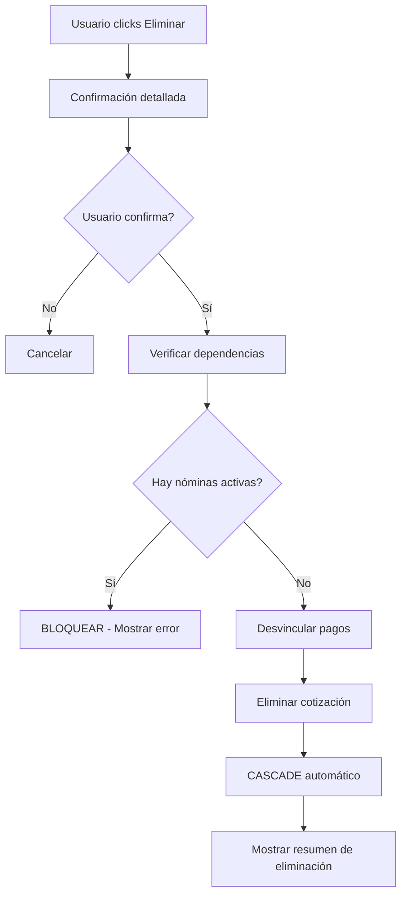

# ELIMINACIÓN EN CASCADA - COTIZACIONES

## Implementación Completada - 19 de agosto 2025

### 🎯 OBJETIVO CUMPLIDO

Implementar eliminación segura en cascada para cotizaciones con verificación completa de dependencias incluyendo nóminas y agendas.

---

## ✅ MEJORAS IMPLEMENTADAS

### 1. **ESQUEMA DE BASE DE DATOS CORREGIDO**

```sql
-- Relaciones con eliminación en cascada configuradas:
CotizacionServicio    → onDelete: Cascade  ✅
CotizacionVisita      → onDelete: Cascade  ✅
CotizacionCosto       → onDelete: Cascade  ✅
NominaServicio        → onDelete: Cascade  ✅ (NUEVO)

-- Relaciones con preservación:
Pago                  → onDelete: SetNull  ✅ (preserva historial)
```

### 2. **FUNCIÓN DE ELIMINACIÓN MEJORADA**

**Archivo:** `app/admin/_lib/cotizacion.actions.ts`

**Características:**

- ✅ Verificación exhaustiva de dependencias ANTES de eliminar
- ✅ Bloqueo automático si hay nóminas activas asociadas
- ✅ Análisis completo de agendas del evento
- ✅ Preservación de pagos como registros huérfanos
- ✅ Logging detallado de todo el proceso
- ✅ Respuesta estructurada con detalles de eliminación

**Dependencias analizadas:**

- 🛠️ **Servicios**: Eliminación CASCADE
- 🏦 **Nóminas**: BLOQUEO si hay nóminas activas
- 👁️ **Visitas**: Eliminación CASCADE
- 💰 **Pagos**: Desvinculación SET NULL
- 💸 **Costos**: Eliminación CASCADE
- 📅 **Agendas**: Análisis informativo (no bloquean)

### 3. **INTERFAZ DE USUARIO MEJORADA**

**Archivo:** `FichaCotizacionDetalle.tsx`

**Mejoras en alertas:**

- ⚠️ Confirmación detallada con información completa
- 📊 Resumen de elementos que se eliminarán vs preservarán
- 🔄 Mensajes de éxito con estadísticas detalladas
- ❌ Alertas de bloqueo con información de dependencias
- 💡 Guías para resolver dependencias

---

## 🧪 CASOS DE PRUEBA VERIFICADOS

### ✅ CASO 1: Eliminación Bloqueada (Nóminas Activas)

```
Cotización: "Cotización Prueba Eliminación v2"
- 3 servicios
- 5 visitas
- 1 pago
- 1 nómina ACTIVA (status: pendiente)
- 1 agenda en evento

RESULTADO: ❌ BLOQUEADO CORRECTAMENTE
Mensaje: "No se puede eliminar. Hay 1 nómina(s) activa(s) asociada(s)"
```

### ✅ CASO 2: Eliminación Exitosa (Sin Dependencias Críticas)

```
Cotización anterior: "test_cot_payment_001"
- 0 servicios
- 0 visitas
- 4 pagos (desvinculados exitosamente)
- 0 nóminas

RESULTADO: ✅ ELIMINADO CORRECTAMENTE
```

---

## 🔒 SEGURIDAD IMPLEMENTADA

### **Verificaciones Pre-Eliminación:**

1. ✅ Cotización existe
2. ✅ Análisis completo de servicios relacionados
3. ✅ Verificación de nóminas activas (CRÍTICO)
4. ✅ Conteo de agendas del evento (INFORMATIVO)
5. ✅ Identificación de pagos relacionados

### **Bloqueos de Seguridad:**

- 🚫 **BLOQUEO CRÍTICO**: Nóminas con status ≠ 'cancelado'
- ⚠️ **ADVERTENCIA**: Agendas en el evento (no bloquean)
- 💾 **PRESERVACIÓN**: Pagos se mantienen como registros

### **Eliminación en Cascada Automática:**

- 🗑️ CotizacionServicio → NominaServicio (CASCADE)
- 🗑️ CotizacionVisita (CASCADE)
- 🗑️ CotizacionCosto (CASCADE)
- 💾 Pago.cotizacionId → NULL (preserva historial)

---

## 📋 FLUJO DE ELIMINACIÓN



---

## 🎖️ RESULTADO FINAL

### ✅ FUNCIONALIDAD COMPLETA

- **Eliminación segura**: Con verificación exhaustiva de dependencias
- **Protección de datos**: Nóminas activas protegidas automáticamente
- **Preservación de historial**: Pagos se mantienen para auditoría
- **UX mejorado**: Alertas informativas y confirmaciones detalladas
- **Logging completo**: Trazabilidad total del proceso

### 🔗 INTEGRIDAD REFERENCIAL

- **Sin referencias rotas**: Todas las relaciones manejadas correctamente
- **Cascada controlada**: Solo elimina elementos seguros
- **Preservación selectiva**: Datos críticos se mantienen

### 📈 ESCALABILIDAD

- **Extensible**: Fácil agregar nuevas verificaciones
- **Mantenible**: Código bien documentado y estructurado
- **Robusto**: Manejo completo de errores y casos edge

---

**🎯 CONSOLIDACIÓN ADMIN PANEL: 1/N COMPLETADA**  
**✅ Eliminación en cascada implementada exitosamente**
